# METIS Desktop 与 DeepSeek Harness 界面对齐说明

> 状态：首批三项及后续 Finder 文件夹粘贴、Desktop 插件商场、METIS 品牌欢迎页、运行中状态、思考展开布局、Composer 聚合菜单与命令面板均已实现，并完成构建、隔离测试与原生客户端验收（2026-08-24）
>
> 范围：会话管理首批交互、Think/工具交错轨迹、macOS 应用图标、Finder 文件夹路径、插件发现与生命周期 UI、空状态品牌文案、Agent 回合运行状态、Composer `+` 聚合入口与 `/` 命令面板
> 结论：本文只覆盖已经明确并有截图或代码证据的项目，不代表 METIS Desktop 已与 DeepSeek Harness 全量对齐；第 8 节仍有未完成的全量能力审计。

## 1. 目标与边界

本轮目标是让 METIS Desktop 在三个用户已明确指出的问题上达到可交付状态：

1. 每个普通会话和已归档会话都可以发起永久删除，经过二次确认后删除 METIS 拥有的会话数据。
2. 对模型实际返回的思考内容建立与工具调用交错的可读轨迹，视觉和交互参考 DeepSeek Harness 的 `Think` 行。
3. 为 macOS `.app` 提供可辨识、可在 Dock/Finder 正确显示的 METIS 图标。

随后根据用户复测又追加四组事项：Finder 文件夹粘贴必须插入可访问的绝对路径；设置页需要真正的插件商场，而非只有空的“已安装”只读视图；欢迎页不能沿用 DeepSeek 的“探索未至之境 / 预览版”品牌文案；Composer 必须保留附件上传，同时提供与 DeepSeek/Codex 同类但职责清楚的命令、目标、计划、权限、模型、技能与插件入口。追加项沿用同一证据、测试和未提交修改保护标准。

以下内容不在本轮三项的完成声明内：完全复刻 Harness 的全部会话管理、所有工具卡片、请求级统计、队列、子智能体、设置页和跨平台打包。它们列在第 8 节，需后续逐项审计。

运行形态按用户最新要求收敛为：

- 保留 METIS Desktop 客户端。
- 保留完整 METIS CLI；桌面端仍可调用仓库中的 CLI 二进制。
- 浏览器单独启动的 METIS Web 实例不作为产品验收入口，也不应误删 CLI、配置或桌面端所需数据。

## 2. 证据与判定方法

### 2.1 用户截图

用户提供的截图在本文中按 S1–S13 引用。原文件位于 macOS 临时目录，现已把参考图和最终客户端截图归档到 `docs/assets/metis-desktop-alignment/`，第 2.3 节使用稳定相对路径展示。

| 编号 | 截图观察 | 本文采用的判定 |
| --- | --- | --- |
| S1 | 暗色圆角空白条，没有可识别的信息或状态 | METIS 的加载/思考占位缺少语义，不应以无内容的视觉块替代真实状态行 |
| S2 | 会话菜单包含重命名、分叉、排序和归档，底部缺少删除动作 | 普通会话菜单缺少永久删除入口；已归档会话也应提供相同入口 |
| S3 | macOS Dock 显示通用占位图标 | `.app` 图标资源或打包/注册链路没有生效 |
| S4 | 会话里能看到工具调用和耗时/速度信息，但没有独立、可展开的 Think 节点 | 工具状态不能替代思考轨迹；需验证模型确实返回思考块后再显示，不能伪造 |
| S5 | Harness 以 `Think · 摘要`、`Bash · 描述` 等行按发生顺序交错展示 | Think 和工具调用必须保留流式顺序、支持展开，并同时覆盖实时和历史回放 |
| S6 | DeepSeek 欢迎页使用“探索未至之境 / 预览版” | METIS 只能借鉴布局，不应复用竞品品牌文案；初始页和新会话重置路径必须同时替换 |
| S7 | METIS 运行状态只剩灰色圆角条和耗时；Harness 在对话尾部显示 `Deep diving...` | 运行状态必须有可读标签、15 秒后追加实时耗时，并贯穿 first-token、流式文本、工具执行和后续模型步骤 |
| S8 | 展开 Think 后，思考正文覆盖后续 assistant 正文 | 展开内容必须按实际高度参与对话文档流，后续消息整体下移，不能依赖可见溢出绘制 |
| S9 | DeepSeek Harness 的命令面板包含 compact、export、feedback、goal、permission、plan、model | METIS 的 `/` 面板不能只剩少数前端快捷项；有真实后端能力的命令应可搜索、可键盘执行，暂不具备的能力不能伪造成功 |
| S10 | Codex Desktop 的 `+` 菜单聚合文件、目标、计划、技能与插件 | METIS 的 `+` 应成为“添加/工作流/命令/配置”聚合入口，同时保留原图片附件入口，并与 `/` 命令面板保持独立 |
| S11 | 导出成功后，顶部 Toast 横向展示完整绝对路径 | 导出反馈只显示紧凑文件名，并提供显式“复制路径 / 打开文件夹”动作；不能让绝对路径占满页面 |
| S12 | 插件商场只显示 `anthropic-agent-skills` 的 5 项，另外两个来源仍为“未同步” | 首次进入应自动补齐所有已注册来源，显示来源计数、总量和可安装数量；大量目录必须分批渲染 |
| S13 | 命令列表显示 `/help` 等斜杠前缀，选择后直接清空输入并执行 | 候选列表隐藏内部 `/` 前缀；选择只把 `/command ` 填入输入框，用户确认发送后才执行 |

S4 的产品归属不能仅由图片元数据证明，因此只把它当作“缺少显式 Think 行”的症状证据，不据此推断后端一定没有思考内容。

### 2.2 本地代码参照

本轮使用本地 `metis/` 与 `deepseek-harness/` 两个代码仓库进行对照；本文只记录仓库内相对路径，不固化开发者机器上的绝对目录。

Harness 中与本轮最相关的参照是：

- `packages/client/ui-conversation/src/client/chat/AssistantMarkdown.tsx`：按 assistant block 原始顺序渲染文本与 reasoning。
- `packages/client/ui-conversation/src/client/chat/ReasoningRow.tsx`：运行中取最新一行作摘要，结束后取第一行；行可展开，并区分 `running`/`ok` 状态。
- `packages/client/ui-conversation/src/client/chat/ReasoningRow.module.css`：24px 行高、扫光、折叠摘要、展开正文和 reduced-motion 处理。
- `packages/client/ui-tool/src/client/tool/components/ToolRow.tsx`：工具行与 Think 行共享 disclosure 交互语言。
- `packages/client/ui-workspace/src/client/rows/Rows.tsx`：会话菜单当前提供重命名、分叉和归档。
- `packages/client/ui-workspace/src/client/WorkspaceBrowser.tsx`：会话归档无确认，因为归档不会删除日志；其中的删除确认状态针对 workspace，不是会话永久删除。
- `packages/client/ui-conversation/src/client/skeleton/InputBar.tsx`：`+` 调用 `toggleCommandMenu`；当前 Harness 的加号实际打开的是命令候选，而不是文件、技能、插件的聚合菜单。
- `packages/client/ui-input-trigger/src/client/MenuView.tsx` 与 `packages/client/ui-commands/src/client/service.ts`：命令由当前会话 Agent 的后端注册表动态提供，并按来源分组渲染。
- `packages/compaction/command-compact`、`packages/goal/command-goal`、`packages/plan/plan-mode`、`packages/interaction/permission-presets`、`packages/session-query/session-log-export`：分别证明截图中的压缩、目标、计划、权限和导出不是纯 UI 文案。

由此得到两个重要结论：

1. Think/工具交错展示可以直接参考 Harness 的 block 顺序、状态和 disclosure 交互。
2. Harness 当前本地代码没有可直接照搬的“永久删除会话”动作；METIS 的会话删除是用户明确要求的扩展，必须自行定义数据所有权和安全契约，不能把 Harness 的“归档”误写成永久删除。

Harness 仓库当前也没有可与 Wails `.app` 一一比较的 macOS 应用图标产物；图标项应按 macOS 原生打包标准验收，而不是声称已复制 Harness 图标。

Codex 参照仓库：本地 `codex` checkout（与 METIS 仓库并列维护，不在本文记录个人绝对路径）。

- `codex-rs/tui/src/slash_command.rs`、`codex-rs/tui/src/bottom_pane/command_popup.rs` 与 `slash_commands.rs` 提供了完整命令注册、描述、过滤与功能开关参照，覆盖 model、permissions、skills、compact、plan、goal、export、apps、plugins 和 feedback。
- 本地开源仓库未包含截图里 Codex Desktop `+` 菜单的实现或“附加 Google Chrome / 录制技能 / 文件和文件夹”等文案。因此 Codex Desktop 截图只能作为已运行产品的交互证据，不能声称从开源代码复制了该菜单。

METIS 最终采用两套互补入口：`+` 只保留图片、文件和文件夹、目标、计划、全部命令、技能与插件六个高频入口，避免把所有能力一次铺满；`/` 当前承载 57 个可搜索、可键盘执行的 Desktop 命令。METIS 的 slash 与 TUI 注册表合并后有 107 个规范命令名，但其中包含退出终端、Vim 输入、语音、Git 全屏视图等终端专属动作；Desktop 只展示已有真实映射的 57 项，不制造点击后无效果的入口。候选容器固定最大高度并内部滚动，不再先截断为 8 项；键盘向下移动时选中项自动滚入视野。命令关键词、标题和说明统一使用英文，以保持 CLI、帮助文档和脚本调用的一致性；周边普通界面继续跟随当前语言。原图片附件 input 未删除；Finder 文件/文件夹通过原生 pasteboard 获取绝对路径；compact、goal、permission、plan 等都连接现有或新增的真实服务端路径，而不是只在前端显示菜单项。`save`、`clear-history`、`undo/edit` 和 `retry` 也通过专用会话 API 持久化变更，不会落入模型输入。计划模式会同时更新 HTTP permission gate 与 Agent loop，避免 UI 显示已切换但运行时仍处于旧模式。

### 2.3 稳定截图对比

以下只归档不含账号、邮箱和本机绝对路径的截图。右侧 METIS 图片来自本轮 clean build 后实际运行的 macOS 客户端，并在收起工作区侧栏后重新截取；含个人环境信息的原始实拍不进入公开仓库。会话删除验证只打开确认框并取消，没有删除真实会话。

| 项目 | 修改前 / Harness 参照 | 本轮 METIS Desktop 实拍 |
| --- | --- | --- |
| 会话永久删除 | 用户截图 S2：菜单没有删除入口 | 原生客户端已验证“删除会话 → 二次确认 → 取消/确认”流程；为避免公开会话路径，不归档该实拍 |
| Think/工具交错 | 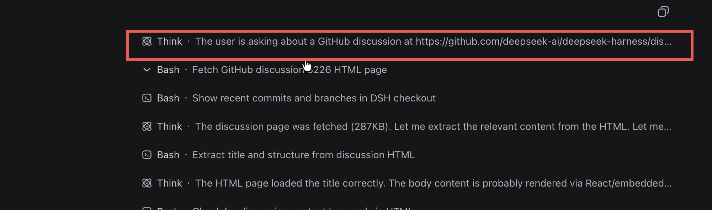 | 同一历史会话已验证 reasoning/tool/text 按 block 顺序进入文档流；含路径的实拍不归档 |
| macOS 应用图标 |  |  |
| Finder 文件夹粘贴 | 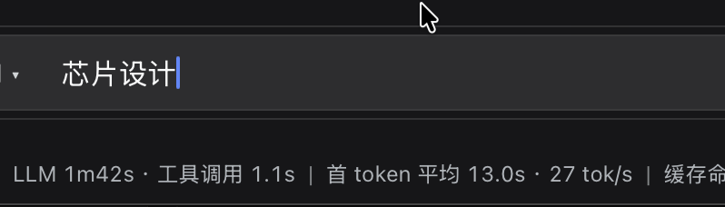 | 原生客户端已验证插入可读绝对路径；为避免公开个人目录，不归档该实拍 |
| Desktop 插件页 | 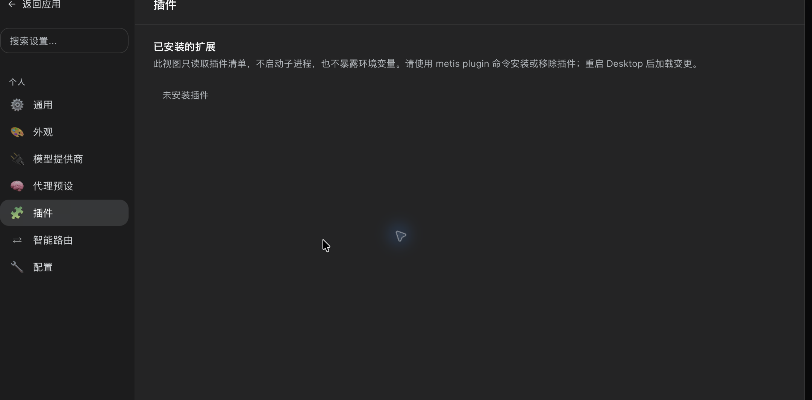 | 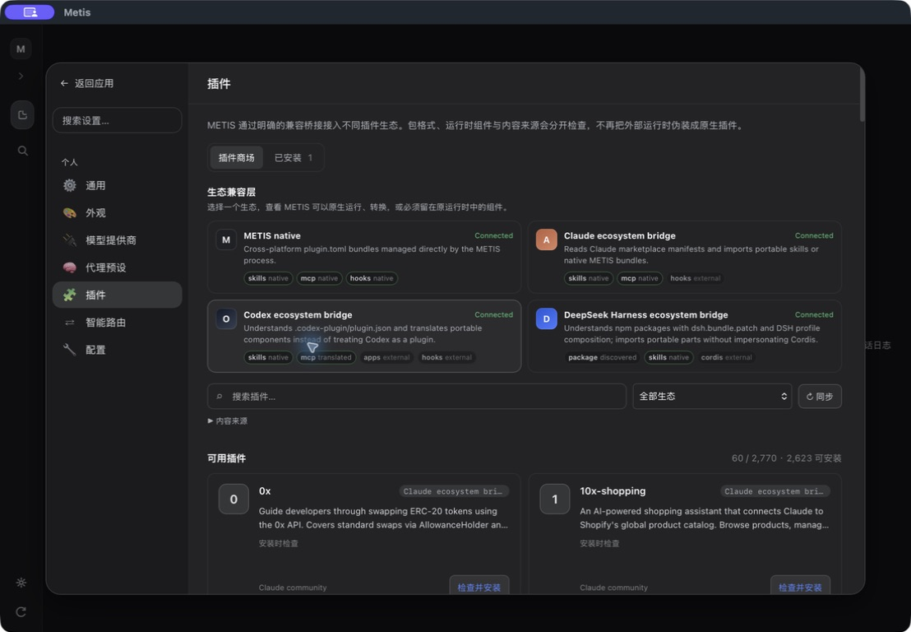 |
| 插件商场完整目录 | 用户截图 S12：仅一个来源的 5 项目录 |  |
| 会话导出反馈 | 用户截图 S11：完整绝对路径占满顶部 | 原生客户端已验证紧凑结果卡与复制/打开动作；含导出路径的实拍不归档 |
| 欢迎页品牌文案 |  | 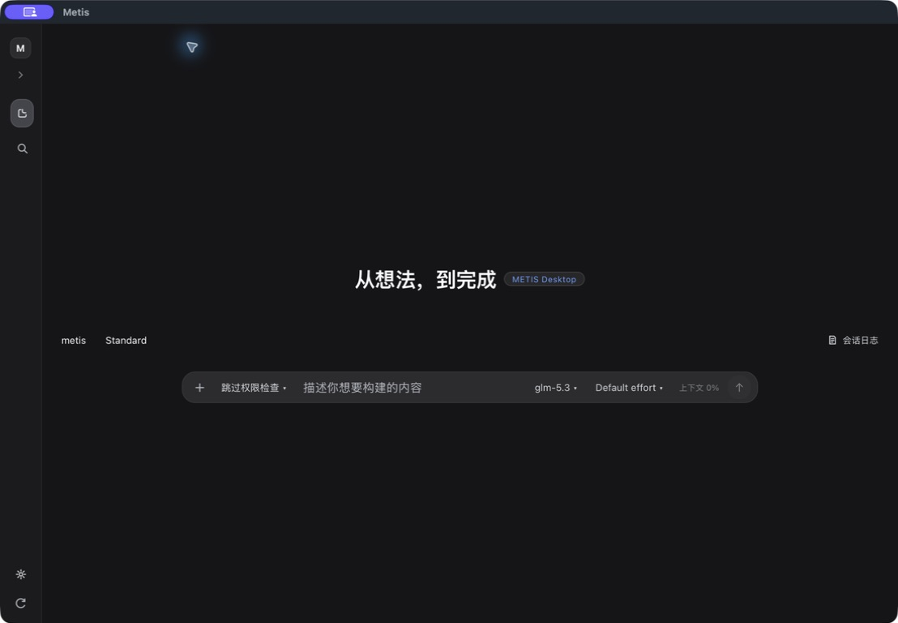 |
| Agent 回合运行状态 |  | 原生客户端已验证 `Deep diving...`、实时耗时和结束结算；含会话身份的实拍不归档 |
| 思考展开布局 | 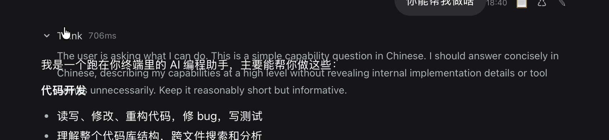 | 原生客户端已验证展开后正文整体下移，并由静态资源回归测试锁定 |
| Composer 命令与聚合入口 | 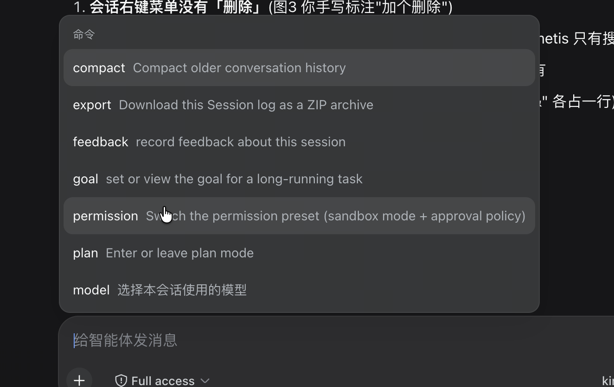<br>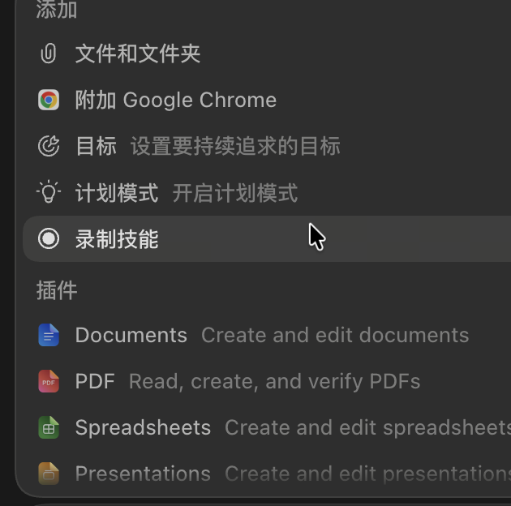 | 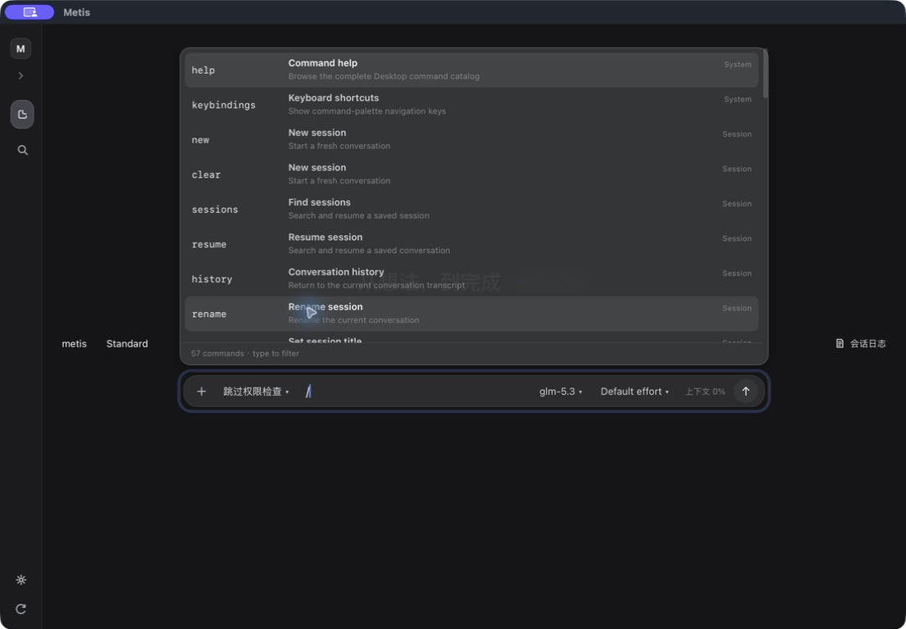<br>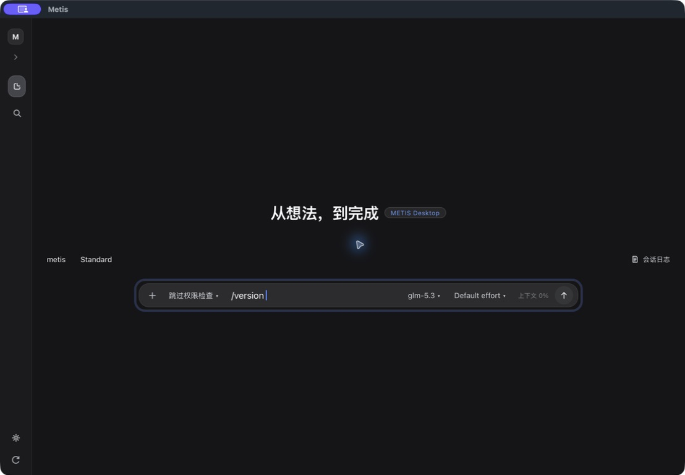<br>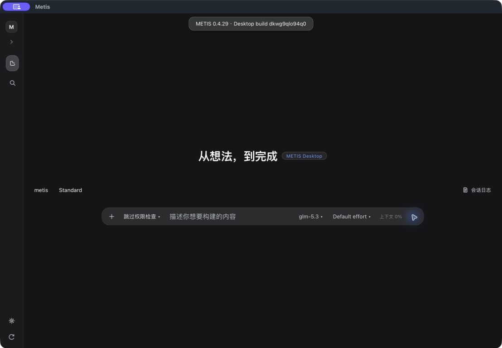 |

Finder 文件夹在 WKWebView 的 `paste` 事件中只暴露一个 `type=""`、`size=0` 的 File 对象及其名称，不暴露 `text/plain`、`text/uri-list` 或 `webkitRelativePath`。因此 Web 层无法从“芯片设计”还原路径。本轮增加 macOS 原生 pasteboard file-URL 读取和同源 POST 解析接口；接口会把浏览器看到的名称与原生剪贴板再次匹配，剪贴板发生变化时返回冲突而不插入错误路径。最终输入格式为 `文件夹: "/绝对路径"`，模型可据此读取目录。

DeepSeek Harness 当前本地实现提供的是可搜索、可展开的只读插件 inventory，不包含可直接复制的插件商场。METIS CLI 已有 marketplace 注册、搜索、安装和移除链路，因此 Desktop 新增独立商场/已安装标签、四个默认注册目录、Codex 与 DeepSeek 本机生态发现、目录同步、来源筛选、本地搜索、安装确认、可恢复移除和重启提示。首次进入插件页会在后台补齐未同步来源；2026-08-24 的 clean-build 快照显示 2,770 项，其中 2,623 项可安装。界面每批渲染 60 项并优先展示可安全安装的条目；需要拉取外部仓库的条目继续明确标为暂不可用，不以扩大数量为由降低固定版本和来源校验要求。目录总数会随上游市场同步和本机已安装生态变化，因此这里记录的是验收快照，不是硬编码产品承诺。

欢迎页保留简洁的标题加胶囊标签布局，但不再复用 DeepSeek 的产品文案。中文改为“从想法，到完成”，英文为“From idea to done”，标签改为“METIS Desktop”；静态初始页面和新建会话后的动态空状态均使用同一套 i18n 文案。

运行状态问题有两个代码根因：旧版 `.ts-pill` 胶囊样式与新版文本 shimmer 同时生效，导致 WebKit 中标签被遮掉而只剩耗时；前端还把每次 assistant `turn_end` 错当成整个 Agent 回合结束，在工具调用或后续模型请求前提前移除状态。本轮删除旧胶囊 DOM/CSS，让 `turn_end` 只结算当前 assistant 消息，以 `loop_done` 或 `/api/turns` 请求完成结算整个用户回合，并在每次追加 Think、工具或消息行时把稳定的状态节点移回对话尾部。原生客户端实测状态为 `Deep diving...`，15 秒后显示 `16.0s`，停止任务后状态移除并生成最终用时行。

思考展开重叠来自 METIS 特有的布局组合：`.chat-area` 同时承担纵向 flex 布局与滚动，而 `.think-row` 允许 flex 收缩；折叠时的 24px 行在展开后仍被压缩，`overflow: visible` 只把思考正文绘制到后续消息上方，并没有撑开文档流。规范化为 `flex: 0 0 auto` 后，展开行使用真实内容高度，后续正文正常下移。该规则由静态资源回归测试锁定，并已在原生客户端同一历史会话中展开复验。

## 3. 对齐矩阵

| 能力 | Harness 可验证行为 | METIS 本轮目标 | 当前工作树状态 | 完成判定 |
| --- | --- | --- | --- | --- |
| 会话归档 | 隐藏会话但保留日志，无二次确认 | 保留现有归档/恢复 | 已有实现 | 归档后可恢复，且不删除会话数据 |
| 会话永久删除 | 未发现对应会话动作 | 普通/归档列表均有删除；二次确认；删除 METIS 可验证所有权范围内的数据 | 已完成：API、普通/归档入口、二次确认、精确清理、并发保护和隔离测试 | 隔离测试证明只删目标数据；原生客户端已打开确认框并取消；未删除真实用户会话 |
| Think 行 | reasoning block 显示为可展开 `Think · 摘要`，运行态扫光 | 实时和历史都显示；结束后摘要稳定 | 已完成：实时、历史回放和 WKWebView 实拍均出现 Think 行 | 有 thinking 的真实/固定夹具会话出现 Think 行；无 thinking 时不造假 |
| Think/工具交错 | 按 assistant block 和 tool-call 事件顺序展示 | Thinking、文本边界、工具开始/结束不串行错位 | 已完成：独立 trace kind、固定序列测试和重启后客户端回放 | 固定事件序列回放顺序与源事件一致 |
| 隐去思考 | 由上游内容模型决定 | 不显示密文，只显示不可展开占位 | 已完成：redacted 固定占位与静态资源/API 测试 | DOM/API/轨迹中均不出现原始密文 |
| macOS 图标 | 无同类 `.app` 产物可直接对照 | 自有 METIS 图标进入 PNG → ICNS → Bundle → Dock/Finder 链路 | 已完成：1024×1024 RGBA、ICNS、plist、签名、clean build 和 Finder 实拍 | 新构建 bundle 使用同一图标；Finder 已验证，不再显示通用占位图标 |
| 会话动作菜单 | Harness 有重命名、分叉、归档等基础动作 | 重命名、从最新消息分叉、上移/下移、归档、删除均可操作；菜单支持键盘和焦点恢复 | 已完成：修正侧栏分叉错误传入索引 `0` 的问题，以 `-1` 明确定义“最新消息”；补齐 menu 语义与方向键/Esc | API 测试证明 `-1` 保留完整历史；真实会话不做破坏性操作 |
| 插件商场 | Harness 当前为可搜索的只读 runtime inventory | 商场/已安装双标签、来源筛选、自动/手动同步、搜索、分批渲染、安装确认、可恢复移除和重启状态 | 已完成：四个默认注册目录并发现本机 Codex/DeepSeek 生态；clean-build 快照显示 2,770 项、2,623 项可安装，每批 60 项；安装确认已打开并取消 | 安装/移除在隔离 `METIS_HOME` 中验收；真实环境只写商场缓存，不改已安装插件 |
| 欢迎页品牌 | DeepSeek 使用“探索未至之境 / 预览版” | 使用 METIS 自有中英文文案，保留独立品牌标签 | 已完成：初始 HTML、语言切换与新会话动态重置入口均已替换 | 静态测试拒绝旧文案；最新版原生客户端实拍显示“从想法，到完成 / METIS Desktop” |
| Agent 回合运行状态 | `TurnStatus` 位于所有 conversation node 之后；运行全程显示 `Deep diving...`，15 秒后显示时钟 | 移除灰胶囊冲突；状态保持在对话尾部并贯穿整个 Agent loop | 已完成：DOM/CSS、`turn_end`/`loop_done` 生命周期、尾部重排和回归测试 | 原生客户端长回复中实拍 `Deep diving... 16.0s`；结束后状态消失并生成最终耗时 |
| 思考展开布局 | ReasoningRow 作为普通内容节点占据实际高度 | 展开 Think 时禁止 flex 收缩，后续正文随内容下移 | 已完成：规范化 `.think-row` flex 行为并增加回归测试 | 原生客户端同一长思考会话展开后无重叠，截图与 AX 树一致 |
| Composer `+` / `/` | Harness 的 `+` 打开后端命令注册表；Codex Desktop 截图显示更宽的聚合入口 | `+` 只放六个高频入口；`/` 收纳 Desktop 可真实执行的命令库并在固定高度内滚动；候选隐藏 `/`，选中后填入输入框 | 已完成：六项紧凑 `+` 菜单、57 项英文命令、真实 compact/goals/session-command API、权限与 plan loop 同步、可访问弹窗和命令解析 | HTTP/静态测试覆盖真实路由和两个独立入口；原生客户端验证 57 项目录与向下滚动，并完成同一条 `version` 命令的“`/ver` 过滤 → 选择 → `/version ` 插入 → 点击发送 → 本地版本结果”闭环 |

以上“已完成”只适用于表中有实现与证据的范围；第 8 节仍是后续全量审计清单。

## 4. 会话永久删除规范

### 4.1 用户交互

- 普通会话的 `…` 菜单在归档之后显示“删除会话”。
- 已归档会话的 `…` 菜单在恢复之后显示“删除会话”。
- 删除是危险动作，使用红色语义，但不要把归档错误地标成永久删除。
- 点击删除只打开自定义二次确认框，不立即请求后端。
- 确认框明确显示目标会话标题、不可撤销说明和清理范围。
- 默认焦点位于明确的操作按钮；支持 `Esc`、遮罩取消、Tab 焦点循环和焦点回到触发按钮。
- 请求进行中禁用两个按钮并显示“正在删除…”，失败时在对话框内显示可读错误且允许重试。
- 如果目标是当前激活会话，删除成功后展示新的空白会话，不保留旧历史、草稿或轨迹。

相关 METIS 文件：

- `internal/webui/static/sessions.js`
- `internal/webui/static/style.css`
- `internal/webui/server.go`

### 4.2 API 与并发契约

建议并以当前工作树为基准的接口：

```text
DELETE /api/sessions/{id}
```

响应语义：

- `200`：返回 `deleted=true`、被删除 ID，以及删除当前会话时的新 `activeSessionId`。
- `400`：ID 不合法或试图越过会话存储边界。
- `404`：目标不存在。
- `409`：有 turn 正在运行；要求先停止后再删除。
- `500`：清理未完整成功；应保留可重试的规范会话记录，并返回不泄露隐私的错误。

删除与运行中的 transcript、trace、task、dump 和 checkpoint 写入不能并发。当前实现以运行锁建立边界；若删除当前会话，先创建并激活新的空会话，再清理旧会话，以避免全局路由或延迟写入重新创建旧文件。

### 4.3 数据所有权边界

“删除全部相关信息”在工程上应解释为：删除由 METIS 内部存储、且能以会话 ID 或精确所有权记录确认属于目标会话的数据。

应删除：

- 会话 transcript JSONL。
- timing、cost 及 cost 临时文件。
- archive marker 和 session tag。
- 该会话的命名 snapshot。
- `SubAgentOf` 精确指向该会话的子智能体 transcript。
- 简单 Todo 和结构化 Task 存储。
- checkpoint/shadow 工作目录。
- runtime crash snapshot。
- trace JSONL、内存索引、序号、缓存和已打开 writer。
- prompt dump 及该会话已打开的 dump handle；等待该会话尚未完成的异步写入后再删除。
- 仅当 workspace crash-recovery pointer 的 `SessionID` 与目标完全相等时，删除该 pointer。
- 当前窗口中引用该 ID 的会话排序偏好和运行时 hub 状态。

应保留：

- ID 只有前缀相同的其他会话，例如 `sess` 与 `sess-extra`。
- 普通 `ForkedFrom` 分支；分支是独立会话，不做级联删除。
- 不属于目标 `SubAgentOf` 的子智能体文件。
- 无法证明所有权的损坏文件；宁可留下供恢复/人工审计，也不能误删其他会话。
- 用户主动导出到任意路径的文件；它们不再是 METIS 内部会话存储，不能静默追踪删除。
- 同一 workspace 中已更新为其他会话 ID 的 crash-recovery pointer。
- CLI 可执行文件、Desktop `.app`、全局配置、provider 凭据、技能和与目标会话无关的缓存。

本轮对旧格式数据采用 fail-closed：历史版本把 `microcompact-cache/*.txt`、`*.spill.txt` 以及部分已退出 job output 放在共享目录中，文件本身没有 session owner 元数据。它们无法被可靠证明属于某一个会话，因此本轮不会按 tool ID 或文件名前缀猜测删除，以免误删其他会话的数据。当前 active registry 能明确证明归属的 job output 会被删除；后续应把 spill/microcompact 改为 per-session 命名空间并提供一次性迁移/清理工具，才能覆盖旧格式残留。

相关 METIS 文件：

- `internal/session/delete.go`
- `internal/session/trace.go`
- `internal/tasks/tasks.go`
- `internal/tasks/task_store.go`
- `internal/checkpoint/delete.go`
- `internal/llm/transport/dump.go`
- `internal/runtime/snapshot.go`
- `internal/session/recovery.go`

### 4.4 删除风险与缓解

| 风险 | 缓解与验收 |
| --- | --- |
| 路径穿越或错误 ID 误删 | 所有删除 helper 独立校验 ID；测试 `..`、斜杠、反斜杠、控制字符和文件系统根 |
| 符号链接把删除指向外部目录 | checkpoint 根和目标路径必须经过安全校验；测试目标 symlink 与 root symlink |
| 同前缀会话或分支被级联删除 | 以精确 ID/嵌入 header 所有权判定；建立邻居会话保留测试 |
| 删除过程中仍有写入 | 运行锁、writer flush/close、异步 dump drain；运行中返回 `409` |
| sidecar 删了一部分，transcript 先消失 | ancillary store 成功后最后删 canonical transcript；失败时保留可见记录供重试 |
| 当前会话被删后旧历史回流 | 先跨越到新空会话，清空 loop/history，再断开旧 session hub |
| 二次确认误操作 | 自定义 modal、不可撤销文案、明确目标标题；不要使用单击即删除 |
| 旧版共享 spill/job 文件缺少归属 | 不猜测删除；新格式迁移到 per-session 目录，旧格式通过显式审计/迁移工具处理 |

## 5. Think 与工具交错轨迹规范

### 5.1 事件与持久化

必须区分以下类型，不能把 thinking delta 合并成普通 text：

```text
thinking
thinking_redacted
text
tool_call / tool_result
user
```

规则：

- 相邻同类型流式 delta 可以合并，以减少 DOM 和 trace 写入压力。
- 从 thinking 转为 text、开始工具调用、收到 redacted thinking 或 turn 结束时，立即结束当前 Think burst。
- 后续又出现 thinking 时新建 Think 行，保留 `Think → Tool → Think → Tool` 的真实顺序。
- 轨迹页与聊天页消费相同语义，不允许聊天正确但 trace 仍把 thinking 标成 text。
- 历史恢复从持久化 assistant content blocks 重建 Think 节点，不依赖只存在于当前进程的流式状态。

相关 METIS 文件：

- `internal/runtime/trace.go`
- `internal/webui/server.go`
- `internal/webui/static/chat.js`
- `internal/webui/static/trace.js`

### 5.2 展示与交互

参照 Harness `ReasoningRow`：

- 折叠态为轻量 24px 行：思考图标、`Think`、圆点分隔、单行摘要。
- 运行中摘要跟随最新一行；完成后稳定为第一行，避免每次打开历史时标题跳变。
- 运行中可使用克制的扫光；遵守 `prefers-reduced-motion`。
- 点击整行或使用键盘可展开/折叠正文；图标在 hover/focus 时给出 disclosure 反馈。
- 展开正文保持换行并可选择复制，不嵌入厚重卡片背景。
- 工具行紧随实际事件顺序，标题优先显示工具类型和简洁意图，详细参数/输出折叠到正文。
- 一个 turn 结束后，Think 与工具行仍保留；刷新和重新打开会话的表现应一致。

### 5.3 隐私和降级

- 只展示 provider/agent 明确提供的 plaintext thinking block；没有 thinking 的模型不得生成假思考文本。
- `redacted_thinking` 只显示“推理已由模型提供方隐藏”一类固定占位，不可展开原始 `Data`，不得把密文写入 DOM、trace 文本或搜索索引。
- 如果 provider 只给最终答案，界面正常显示答案，不保留 S1 那种无语义空白占位。
- 很长的 thinking 应保持增量更新和折叠默认，避免每个 token 触发全量 Markdown 重排。
- 中断、错误和取消必须终止 running 动画，并保留已收到的安全内容及明确状态。

### 5.4 验收场景

1. `thinking → text`：先看到运行中的 Think，文本出现时 Think 结束，答案不被吞入 Think。
2. `thinking → tool_call → tool_result → thinking → text`：显示两个 Think burst 和一组工具行，顺序完全一致。
3. 历史恢复：刷新/重启 Desktop 后，第一行摘要、展开正文和工具顺序不变。
4. redacted：只有固定占位；测试密文字符串在响应、DOM、trace/search 中均不存在。
5. 无 thinking：只显示工具/文本，不出现空 Think、空圆角条或虚构摘要。
6. 中断：Think 停止 running 状态，已有内容仍可查看。
7. 辅助功能：Enter/Space 可切换，焦点可见，screen reader 有运行状态，reduced-motion 下无扫光动画。

## 6. macOS 图标规范

### 6.1 设计与源文件

当前目标图标为深色圆角方形底，使用靛蓝/紫色轨道形成抽象 METIS 标记，并以克制的青色核心增强小尺寸辨识度。设计原则：

- 不使用文字、Apple 标志、聊天气泡或难以在 16–32px 识别的细线。
- 与 METIS 深色桌面 UI 协调，但在深浅 Dock/桌面背景上都能读出轮廓。
- 保留足够安全边距和规范透明通道，避免 Finder/Dock 出现白边、棋盘或二次圆角。
- 原始生成图、上一版图标和最终生产源图分开保存，方便回退与重新裁切。

相关文件：

- `metis-desktop/build/appicon.png`：Wails 生产源图，1024×1024 RGBA。
- `metis-desktop/build/appicon-generated-source.png`：生成原图留档。
- `metis-desktop/build/appicon-previous.png`：用户原有图标备份，不应覆盖丢失。
- `metis-desktop/wails.json`：产品名、版本和 bundle 元数据。
- `metis-desktop/build/darwin/Info.plist`：`CFBundleIconFile=iconfile`。

### 6.2 打包链路验收

执行 clean build 后逐项验证：

1. `appicon.png` 为 1024×1024、RGBA/含 alpha，视觉检查无假透明棋盘。
2. `.app/Contents/Resources/iconfile.icns` 存在，并可解包出多尺寸表示。
3. `.app/Contents/Info.plist` 的 bundle identifier、版本和 `CFBundleIconFile` 正确。
4. bundle 通过适当的 `codesign --verify` 检查。
5. 精确启动新构建的 bundle，不被 `/Applications` 中旧副本或相同 bundle ID 的缓存版本替代。
6. Finder、Dock、App Switcher 和运行窗口均显示新图标；退出再启动后仍保持。
7. 若 LaunchServices 仍缓存旧图标，先注册新 bundle 并重启目标应用；只有证据表明必要时才刷新 Dock。

图标完成声明必须验证新构建在 Dock/Finder 中的实际显示，不能只检查源 PNG。若截图会暴露本机账号或已安装应用清单，只保留本地审计记录，不进入公开仓库。

## 7. 分阶段实施与验收 Plan

### Phase 0：基线与冲突保护

- 记录 `git status --short` 和三项相关文件的 diff；当前仓库存在大量用户未提交修改，禁止 reset、checkout 或覆盖无关改动。
- 将本轮修改限制在删除链路、Think/trace、图标/打包和必要测试；遇到同一 hunk 冲突时先人工合并。
- 记录正在运行的 Desktop bundle、CLI 路径和端口；停止浏览器专用实例时按 PID/命令行精确匹配。
- 保存用户五张参考图的编号映射；最终截图写入稳定目录。

验收门：未提交修改仍保留；CLI 与 Desktop 源码/二进制存在；没有误删用户会话。

### Phase 1：会话永久删除

- 完成存储层精确删除 helper 与隔离测试。
- 完成 `DELETE /api/sessions/{id}`、运行态保护和当前会话 replacement。
- 在普通/归档菜单增加删除入口和自定义二次确认框。
- 覆盖 target/neighbor、前缀碰撞、subagent ownership、pointer ownership、symlink/path traversal、active/busy/idempotent 场景。

验收门：只在 `t.TempDir`/隔离 `METIS_HOME` 中做真正删除测试；原生客户端只验证“打开确认框并取消”，不删除用户真实会话。

### Phase 2：Think/工具交错轨迹

- 修正事件适配器，使 thinking 与 text 为独立 burst/kind。
- 补齐实时 chat、历史重建、trace pane、redacted 占位和结束边界。
- 对齐 Harness 的折叠行、运行态、完成态、键盘和 reduced-motion。
- 用固定事件夹具覆盖第 5.4 节场景，再用本地已有且确认含 thinking block 的会话做只读客户端检查。

验收门：固定夹具顺序正确；重启后一致；redacted 密文不可见；无 thinking 时不出现空块。

### Phase 3：macOS 图标与启动链路

- 保留旧图标备份，接入生产源图和 Wails bundle 元数据。
- 重建 CLI、frontend 和 Wails `.app`，使用 clean build 避免旧 ICNS 混入。
- 注册并精确启动新 bundle；检查 plist、ICNS、签名和真实 Dock/Finder 表现。

验收门：新图标在源构建客户端实际显示，并保存客户端截图；Desktop 不再停留在无内容启动占位页。

### Phase 4：整体验证与证据归档

- 运行相关 Go 单元/HTTP 测试、JS 语法检查、静态资源测试和 `git diff --check`。
- 尽可能运行更大范围测试；若存在与本轮无关的旧失败，记录精确命令与失败归属，不能写成全部通过。
- 在最新 Desktop 客户端完成只读 UI 演练：打开含 Think 的会话、展开/折叠、查看工具顺序、打开删除确认并取消、确认 Dock 图标。
- 截图需包含应用窗口边界或可确认的客户端上下文，并记录构建版本/路径。

验收门：文档中的“当前工作树状态”更新为有命令和截图证据的结果；未验证项保持未完成。

本轮最终证据（2026-08-22）：

- `node --check`：`sessions.js`、`chat.js`、`trace.js` 全部通过。
- 删除/Think 相关 Go 包定向测试：`internal/session`、`internal/tasks`、`internal/checkpoint`、`internal/llm/transport`、`internal/runtime`、`internal/webui`、`cmd/metis` 全部通过；真正删除仅发生在测试临时目录。
- 根模块 `go test -count=1 ./...` 全部通过，0 个失败包。
- `npm --prefix metis-desktop/frontend run check` 与 `metis-desktop` 模块 `go test -count=1 ./...` 通过。
- Wails `build --clean --platform darwin/arm64` 成功完成 bindings、frontend、compile、package 和 self-sign。
- clean build 的主程序、ICNS、plist 校验一致；bundle 版本 `0.4.29`，`codesign --verify --deep --strict` 通过。为避免覆盖用户已安装版本，本轮验收直接启动仓库构建产物。
- 最终客户端通过受支持的 `--metis-bin` 参数绑定仓库最新 CLI，本轮最终复验窗口启动在 `127.0.0.1:61363`，`/api/health` 返回 `status=ok`；发现并精确停止了仍占用 `49181` 的旧客户端实例后，AX 树与静态资源均确认来自最新构建。直接双击且不传该参数时，当前 shell 会回退到 `~/.local/bin/metis`，因此本轮没有覆盖用户已安装的 CLI。
- 原生客户端已打开删除确认框并点击“取消”；真实会话保留。Finder 已显示新的 Metis 图标。
- 原生客户端已验证六项紧凑 `+` 菜单、57 项英文 `/` 命令和固定高度滚动列表；连续向下导航 24 次后，选中项与视口一起滚到权限类命令，证明不再受 8 项截断影响。
- 原生客户端已验证命令候选隐藏 `/`，输入 `/ver` 后从候选选择 `version`，输入框保留 `/version ` 且未立即执行；随后点击发送，输入框清空并显示 `METIS 0.4.29 · Desktop build …` 本地结果。复测同时移除了 Web 配置接口中写死的旧版本号；根 `VERSION`、CLI、npm 和 Wails/Desktop 元数据由 `verify-version` 发布门保持一致。插件页 clean-build 快照显示 2,770 项和 2,623 项可安装计数；导出反馈不再暴露整条路径，并提供复制路径与打开文件夹动作。
- `git diff --check` 通过；原有未提交修改保持在工作树，未执行 reset/checkout。

### Phase 5：后续全量 Harness 审计

- 按第 8 节建立能力矩阵与截图基线。
- 每项区分“视觉差异”“交互缺失”“后端能力缺失”“仅产品选择不同”，避免盲目复刻。
- 对高风险或会改变数据模型的差异单独出设计和迁移计划。

### Phase 5A：Composer 聚合菜单与命令面板

- 对照 DeepSeek 的动态命令注册与 Codex 的命令/聚合入口，明确代码证据和仅截图可证的边界。
- 保留原图片附件按钮的底层 file input，把 `+` 改为只有六个高频入口的独立聚合菜单；通过“图片附件”和“Finder 中复制的文件和文件夹”区分两条输入链路，完整能力转入 `/`，避免菜单过高。
- 将 `/` 扩充为 57 个 Desktop 可真实执行的英文命令，覆盖会话新建/查找/重命名/分叉/保存/清空/撤销/重试、compact/export/feedback/goal、permission preset、plan、model/effort/providers/presets、skills/plugins/agents/tasks/tools、routing/config/settings/appearance/theme/thinking、trace/status/context/doctor/version/stop；支持搜索排序、内联参数、键盘选择和固定高度内部滚动。
- `compact` 调用 Compactor 并持久化替换历史；goal 写入真实 GoalStore；permission/plan 同步 Gate 和 Loop；插件入口复用 Desktop 插件商场。
- 用自定义可访问弹窗承载目标、反馈和权限选择，覆盖焦点恢复、焦点循环、Esc、遮罩取消、提交中和错误状态。
- METIS CLI/TUI 的两个注册表合并后共有 107 个规范命令名；本轮只把具备 Desktop 映射的 57 项放入面板，不为终端专属能力制造无效入口。后续若新增 Desktop handler，应同步增加目录、执行分支和回归测试。

验收门：单元/HTTP/静态资源测试通过；`+` 与 `/` 可同时独立使用；最新版 `.app` 中打开两套菜单并留存截图；不得把尚无运行时实现的 Codex 专属动作伪装成可用功能。

插件商场追加验收（2026-08-22）：

- `GET /api/plugins/catalog` 只读本地注册表和已同步清单；未同步来源以明确状态展示。
- 首次进入插件页若发现未同步来源，会自动调用 `POST /api/plugins/catalog/refresh` 补齐全部注册目录；用户仍可手动同步当前来源或全部来源，更新使用 fast-forward 且不覆盖非 Git 缓存。
- 安装采用受限目录复制、路径边界、符号链接拒绝、文件数/体积上限和原子落盘；外部 URL 型插件在校验与固定版本策略完成前标为“暂不可用”。
- 移除不直接永久删除，而是移动到 `<METIS_HOME>/trash/plugins/`；已加载进程在重启前保持不变。
- 安装与移除都有自定义二次确认、请求中禁用、错误重试、焦点循环、`Esc`、遮罩取消和操作后焦点恢复。
- 搜索、商场来源按钮、`select`、tab 和状态播报具备键盘/ARIA 语义；动画遵守 `prefers-reduced-motion`。

## 8. 后续仍待审计的 Harness 对齐项

以下仅为待审计清单，不表示 METIS 当前缺失，也不表示决定照搬：

- 会话列表：状态点、运行/等待审批/等待回答/已完成/失败提示、搜索、分组、拖拽排序、归档浏览、分叉树和空会话处理。
- 会话详情：标题、工作区、provider/model、权限模式、reasoning effort、更新时间和 token/成本摘要。
- 回合统计：时间、总耗时、首 token 延迟、tokens/s、输入/输出/缓存/reasoning token 和工具耗时。
- 工具展示：Bash、Read、Edit、Search、Web、Todo、MCP、Computer Use 等不同 card/row，输入输出、diff、文件跳转、错误/中断状态。
- 轨迹面板：按 turn 折叠、搜索/过滤、请求边界、原始事件、统计 inspector、分页和大日志性能。
- Composer：六项紧凑 `+` 菜单、图片附件、Finder 路径、57 项英文 `/` 命令、目标/计划/权限/模型/effort/技能插件入口已完成并在原生客户端验收；会话级 `save/clear-history/undo/edit/retry` 已接入持久化服务。`@` 引用、队列编辑/移除和更完整的 steer 交互仍待审计。
- 权限流程：ask、accept edits、bypass/完全访问的语义一致性，以及无需确认时不再出现 Yes/No。
- 子智能体与后台任务：层级、进度、状态、终止、消息和结果归并。
- 空状态与加载：欢迎页品牌文案已独立；建议项、骨架屏、断线/重连、错误恢复仍待审计，尤其是 S1 类型的无语义占位。
- 可访问性：完整键盘路径、焦点管理、ARIA、对比度、缩放和 reduced-motion。
- 工作区与多窗口：新增/重命名/移除/重排、会话移动、窗口间状态隔离和原生文件打开。
- 设置与插件：插件商场基础发现、安装和可恢复移除已完成；provider/model、MCP/技能细粒度配置、更新、日志/反馈和隐私控制仍需逐项审计。
- 原生体验：菜单栏、通知、深浅色、窗口恢复、签名/公证、自动更新和旧 bundle 冲突。

## 9. 完成声明模板

只有全部满足以下条件，才能对本轮三项写“已完成”：

- [x] 删除存储、HTTP 和 UI 测试通过，且测试未触碰真实用户会话。
- [x] 普通和归档菜单均生成二次确认入口；普通会话已在原生客户端打开并取消，归档入口由静态资源测试覆盖（当前没有可用于只读演练的归档会话）。
- [x] 真实或固定夹具中的 Think/工具事件按顺序显示，刷新/重启后一致。
- [x] redacted thinking 未泄露原始数据；无 thinking 时没有虚假占位。
- [x] clean build 的 `.app` 在 Finder 显示新图标，plist/ICNS/签名检查通过。
- [x] 最新 METIS Desktop 已精确启动并留下稳定路径截图。
- [x] `+` 菜单只显示六个高频入口；`/` 面板显示 57 个 Desktop 可执行命令并在固定高度内滚动，原生客户端截图已归档。
- [x] 命令候选隐藏 `/` 并先填入输入框；插件商场包含四个默认注册目录及本机 Codex/DeepSeek 生态发现，clean-build 快照显示 2,770 项且分批展示；导出使用紧凑结果卡和显式路径动作。
- [x] CLI 仍完整可用，浏览器专用实例清理没有影响 CLI/Desktop。
- [x] 用户原有未提交修改仍在；没有覆盖或重置无关文件。
- [x] 第 8 节继续标注为“待审计”，没有声称已完成全量 Harness 对齐。
